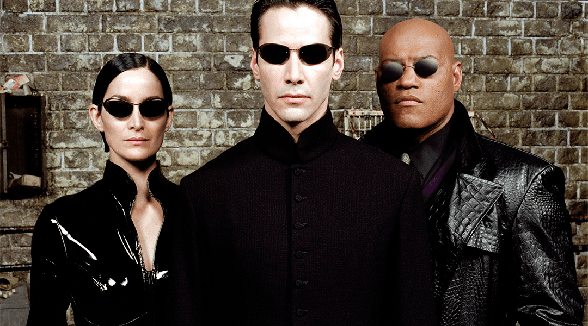

#  Matrix: El Elegido

### Colecciones y bloques. Ejercicio breve 

Tenemos a neo, morfeo y trinity que son los pasajeros de la nave, que pueden bajarse de la nave y eventualmente volver a subir. 
* Neo es el elegido, empiea con 100 de energia, pero cuando salta pierde la mitad de su energia. Su vitalidad es la décima parte de su energía
* Morfeo no es el elegido. Su vitalidad es inicialmente 8, pero puede variar, empieza descansado y al saltar se cansa, pero si salta estando cansado, vuelve a quedar descansado. Simpre que salta, su vitalidad disminuye en 1. 
* Trinity sabe decir su vitalidad, que siempre es 0. Saltar no la afecta. No es la elegida.

De la nave nos interesa averiguar: 
* Cuántos pasajeros hay
* El pasajero de mayor vitalidad
* Si está equilibrada en vitalidad, lo que sucede cuando ninguno de los pasajeros tiene más que el doble de vitalidad que cualquier otro pasajero.
* Si el elegido está en la nave 

Y tambien hay hechos que le suceden a la nave
* Cuando la vane choca, todos sus pasajeros saltan para salvarse y se van de la nave. 
* Cuando la nave acelera, todos sus pasajeros, excepto el elegido, saltan de alegría y permanecen en la nave.	
